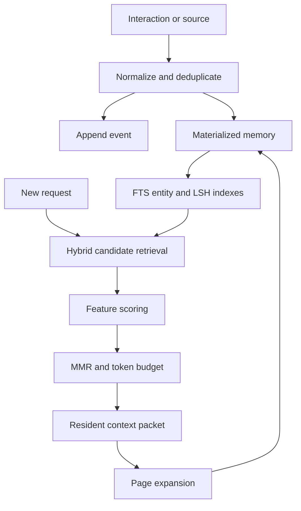
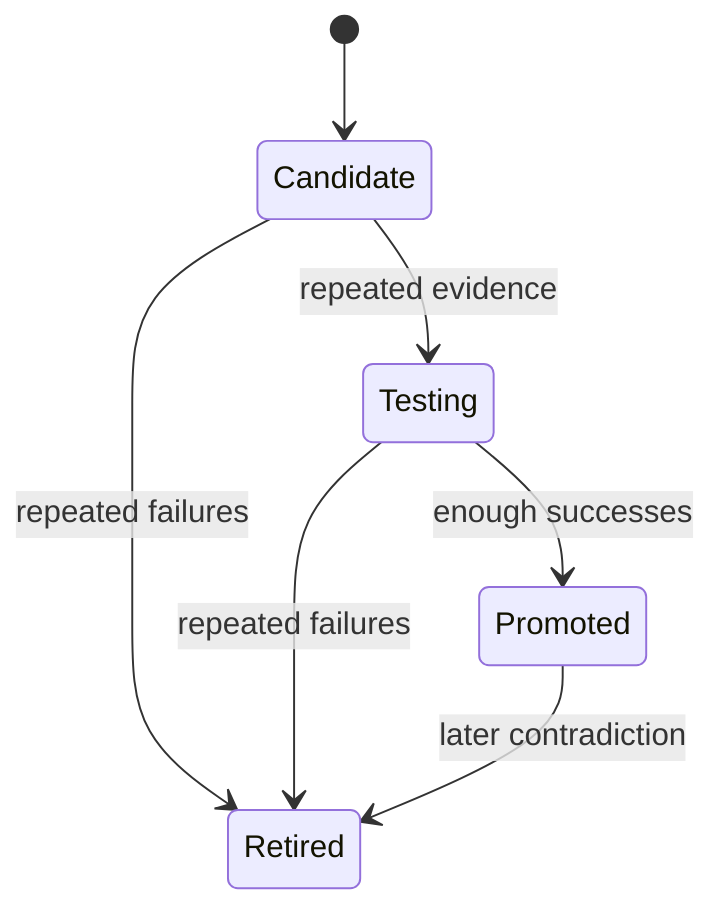

# Architecture and invariants

## Governing objective

Continuum Memory supplies a fixed or slowly changing language model with durable experience, instant recall, and a virtual context space larger than its resident prompt. It must preserve the distinction between recorded evidence, derived claims, and validated behavioral policy.

## System invariants

1. **Raw history is not silently rewritten.** Corrections supersede records; deletion uses an explicit tombstone event.
2. **Derived information retains provenance.** Summaries and consolidated claims link to their source memory ids.
3. **Observation is not policy.** Behavioral policies require repeated outcome evidence before promotion.
4. **Recall is budgeted.** Retrieval cannot overrun the caller's declared token budget.
5. **Memory is data.** Stored text is untrusted and cannot instruct the storage service to perform actions.
6. **Namespaces are isolated in retrieval and links.** They are organizational boundaries, not security principals.
7. **Temporal truth is explicit.** Claims can carry `valid_from`, `valid_until`, supersession, and contradiction grouping.
8. **Every mutation is auditable.** The append-only event stream records creation and state transitions.
9. **Provider failure does not destroy experience.** Writes can persist without an embedding and be reindexed later.
10. **Effective context is not native context.** Paging and summaries increase accessible information, not transformer capacity.

## Data path

## Storage model

| Structure | Responsibility |
|---|---|
| `memory_events` | Append-only mutation and policy evidence audit trail |
| `memories` | Current materialized memory state and dense-vector bytes |
| `memory_fts` | Full-text candidate generation |
| `memory_entities` | Canonical entity lookup and continuity scoring |
| `vector_buckets` | Bounded approximate dense-vector candidate generation |
| `memory_links` | Provenance, summarization, derivation, and support edges |
| `retrieval_log` | Latency, selection, token usage, and candidate diagnostics |
| `policies` | Behavioral hypothesis lifecycle |
| `policy_evidence` | Outcome observations supporting or contradicting policy |

SQLite runs in WAL mode with normal synchronization, an in-memory temporary store, a busy timeout, and bounded memory mapping. A process-level reentrant lock serializes the single connection safely for the local reference server.

## Retrieval

Candidate ids are gathered independently from:

- FTS5 lexical rank
- LSH buckets for dense-vector neighborhoods
- Canonical entity overlap
- A small resident set ranked by salience, confidence, and recency
- One-hop provenance neighbors for summaries and derived claims

Each source is independently ranked, then combined with weighted reciprocal-rank fusion. This prevents a large lexical result set from excluding entity, vector, graph, or resident candidates before reranking. For memory \(m\) and query \(q\):

\[
S(m,q) =
0.20L + 0.30V + 0.15E + 0.08G + 0.09R + 0.07I + 0.05C + 0.06K
\]

Where:

- \(L\): lexical rank
- \(V\): cosine similarity
- \(E\): entity overlap
- \(G\): provenance-graph proximity
- \(R\): exponentially decayed recency
- \(I\): stored importance
- \(C\): confidence
- \(K\): continuity prior for working, identity, procedural, reflective, and summary memory

The score receives a small token-efficiency adjustment. Maximum marginal relevance then reduces redundant selections. The implementation caches token sets and incremental redundancy so the diversity pass remains bounded.

Exact LSH buckets are queried first. If a semantic-only query has weak bucket coverage, the system probes buckets one Hamming bit away. For namespaces of at most 15,000 active records, semantic-only queries also receive an adaptive exact-vector fallback. Callers can force or disable this scan per request.

## Federated library

`FederatedMemoryService` composes independent `MemoryService` instances rather than placing every book behind one shared SQLite connection. The catalog persists book descriptors and routing embeddings; each `{book_id}.db` retains the complete single-book invariants.

The query is embedded once, routed to a bounded set of books, and passed to each selected retriever as a precomputed vector. A thread pool overlaps their independent read paths. Cross-book reciprocal-rank fusion combines book rank, routing relevance, book priority, and the local hybrid score. Exact content hashes remove duplicate copies before a soft per-book quota and global token budget are applied.

Book-qualified page references use `book_id:memory_id`. Provenance traversal remains within a book, avoiding ambiguous links and cross-database transactional claims.

## Hierarchical context

Context has two levels in the MVP:

1. A resident packet containing memories that fit the token budget.
2. Stable page ids that expand to full content, provenance links, and source memories.

Consolidation creates summary nodes linked to the source episodes. Recursive consolidation can create additional levels without deleting earlier nodes. A production scheduler must prevent summary-of-summary drift by periodically grounding recursive summaries back in original source leaves.

## Behavioral policy lifecycle

Promotion thresholds are deterministic in the MVP: at least three decisive outcomes and a success rate of at least 0.75. Promotion materializes a procedural memory. Retirement archives it. The policy record and all evidence remain available for inspection.

## Scaling path

The reference implementation optimizes for a single process and tens of thousands of records. The interfaces deliberately separate storage, embedding, retrieval, and consolidation so later versions can replace components without changing the memory contract.

| Scale | Change |
|---|---|
| Multi-process local | Connection pool plus a dedicated writer process |
| Millions of memories | PostgreSQL and `pgvector`, or a dedicated HNSW vector service |
| Sub-10-ms hot recall | Redis-compatible resident cache and query prefetch |
| Large source artifacts | Content-addressed object storage with memory records as indexes |
| Continuous consolidation | Durable job queue with idempotent consolidation checkpoints |
| Multi-tenant deployment | Authenticated principals, row-level authorization, encryption, and retention controls |
| Learned ranking | Offline judgments and counterfactual logs feeding a calibrated ranker |
| Many memory domains | Routed independent books with bounded concurrent fan-out |

## Known MVP boundaries

- The hashing embedder is lexical, not semantic.
- LSH provides bounded approximate candidates, not HNSW-level recall at large scale.
- Entity extraction is intentionally lightweight; production use needs a proper entity resolver.
- Consolidation is manual rather than scheduled.
- The local HTTP server has no authentication, authorization, TLS, or rate limiting.
- The database is not encrypted at rest.
- A promoted external policy influences retrieved context but cannot modify model weights.
- Cross-book writes are not transactional, and provenance graphs do not yet cross book boundaries.
